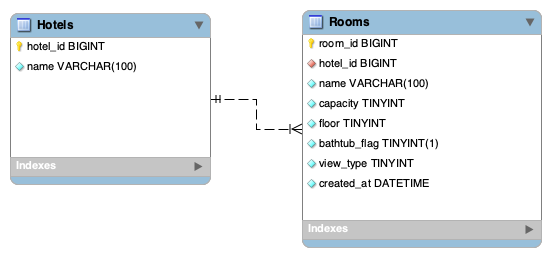

# 데이터베이스 설계

* 요구사항을 기반으로 데이터베이스를 설계합니다.

## 참고

### Hotels(호텔), Rooms(객실) Table

* hotels(호텔), rooms(객실) Table을 Base로 추가하여 작성합니다.
* [hotels.sql](..%2Fhotels.sql)을 제공해 드린 db에서 실행합니다.

## 설계 도구

* [ERD Cloud](https://www.erdcloud.com)
* ERD `submit/erd.jpg`에 저장합니다.
* DDL `submit/db.sql` 에 저장합니다.

## DB Server 배포

* 제공해 드린 MySql에 배포합니다.
* 모든 Table에 Sample Data를 등록합니다.

## 다음 조건을 만족하는 SQL을 [submit/1.md](./../../submit/1.md) 작성하세요

* CheckIn 날짜가 `2024-05-01` 모든 객실 조회
* `2024-05-01` ~ `2024-05-31` 예약된 객실을 조회
* 현재 예약 가능한 객실 리스트 조회
* 아이디가 100인 회원의 사용 가능한 포인트를 조회
* `객실 ID가 1L` 인 객실의 리뷰 조회 (관리자가 승인한 리뷰만 노출, 등록 일자 기준 내림차순 정렬)